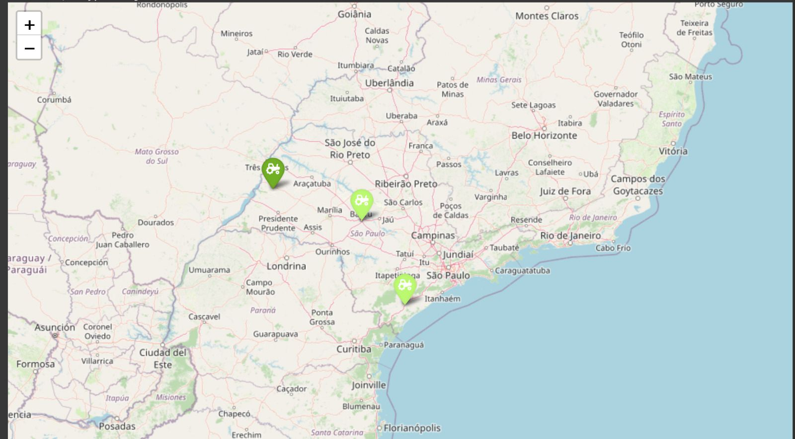

# 
# Sistema de informação para apoio à tomada de decisão
<table>
<tr>
<td>
  Uma empresa agrícola deseja adquirir uma fazenda para plantio no Estado de São Paulo. O objetivo é escolher a cidade mais adequada para o plantio de uma determinada cultura em uma época específica do ano. O sistema utilizará dados climáticos, como pluviometria e temperatura, para fornecer informações sobre as cidades mais propícias para cada cultura e estação do ano. O sistema permitirá a escolha entre 20 opções de culturas e terá informações de 30 cidades.
</td>
</tr>
</table>

## Objetivo
Desenvolver um sistema onde o usuário possa escolher a cidade e estação ideal para cultivo de diferentes culturas, com base em informações e especificações de cada tipo de plantio. O sistema também contará com um mapa interativo, onde poderá visualizar as cidades escolhidas, e ver quais foram os critérios de escolha.

## Dados utilizados 
- Dados climáticos (pluviometria (mm por estação) e temperatura (média de C por estação)) de cada estação do ano para 30 cidades em São Paulo.
- Informações sobre 20 diferentes culturas, incluindo as temperaturas (C ) e pluviometrias (mm por estação) ideais para o cultivo.
- coordenadas geográficas das cidades

## Fonte de obtenção das informações
- Dados climáticos foram obtidos da instituição meteorológica INMET, Instituto Nacional de Meteorologia. URL: https://tempo.inmet.gov.br/TabelaEstacoes/A001
- Informações sobre culturas foram adquiridas no site da Empresa Brasileira de Pesquisa Agropecuária (EMBRAPA). URL: https://www.embrapa.br/agencia-de-informacao-tecnologica/cultivos
- Coordenadas geográficas foram obtidas no site cidade-brasil. URL: https://www.cidade-brasil.com.br/estado-sao-paulo.html

## Características sobre a qualidade das informações

- **Atualidade**:  Foram utilizados dados climáticos do ano de 2022-2023, uma vez que deve refletir as condições climáticas atuais
- **Precisão**: As informações sobre culturas e condições climáticas foram retiradas de fontes precisas e confiáveis, sendo institutos nacionais respeitados

## Descrição do modelo: 

### Descrição textual
O modelo considerará as condições climáticas e pluviometria  ideais para cada cultura em cada estação do ano nas 30 cidades. As cidades com a melhor combinação de fatores serão recomendadas.

### Como utilizar

https://github.com/Najuzinh4/SIS-Decision-Support/assets/109618169/2d4f72b6-8fcb-494d-96b8-e77b8958ca8e

### Critérios e regras
 O sistema utiliza a temperatura e pluviometria ideais da cultura escolhida e compara com cada cidade e suas estações. Se um dos critérios (temperatura ou pluviometria) estiverem dentro da faixa de valores, a cidade será escolhida e apontada no mapa.

## Problemas e limitações
- Os dados das culturas podem não ser precisos, o que pode afetar a confiabilidade das recomendações.
- A falta de dados de algumas cidades, podem afetar a confiabilidade das recomendações

## Conclusão
 O sistema oferece uma abordagem baseada em dados para a escolha da cidade ideal para o plantio, mas é importante considerar as limitações e monitorar as mudanças climáticas.

